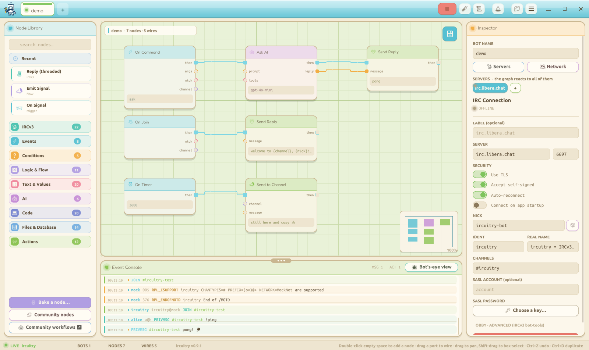

# ircuitry - IRCv3 Bot Bakery

A polished, game-feel desktop app for building **IRCv3 bots** with a visual,
node-graph workflow editor - a cozy, hand-drawn take on flow-based automation.
Drag trigger / filter / action nodes onto a canvas, wire them together, point
ircuitry at a server, and press **RUN BOT**. The bot connects over real IRCv3
(TLS, CAP negotiation, SASL) and reacts to live traffic - all rendered in a warm,
hand-built UI (cream paper, leaf-green canvas, rounded pastel node cards, soft
shadows).

Run **multiple bots** side by side (each its own connection + runtime), reach any
**OpenAI-compatible LLM endpoint** (hosted or local) and any **HTTP API**, and
**save** the whole workspace - flows *and* connection settings - to one file.

Everything you see is drawn from scratch in **MonoGame** (no OS widgets): the
panels, the node cards, the bezier wires, the glow, the scanlines, the text
fields - all procedural.



## Download

Grab a ready-to-run build from the [latest release](https://github.com/ircuitry/ircuitry/releases/latest):

- **Linux:** the **AppImage** (`chmod +x ircuitry-*.AppImage`, then run it), a **`.deb`**
  (`sudo apt install ./ircuitry-*-amd64.deb`, adds a menu entry and an `ircuitry` command),
  or the portable zip (unzip, run `./Ircuitry`).
- **Windows:** the zip; unzip and run `Ircuitry.exe`.
- **macOS:** the zip; unzip, move `ircuitry.app` to Applications, then right-click and Open
  (it is unsigned).

Every build is self-contained, so no .NET install is needed. To build from source instead:

## Quick start

```bash
# build + run
dotnet run --project src/Ircuitry

# headless logic tests (executor, IRC parser, full socket loop)
dotnet run --project src/Ircuitry -- --selftest

# offline live demo (runs the bot against an embedded mock IRC server)
dotnet run --project src/Ircuitry -- --demo

# headless / daemon - run the saved workspace's bots with no window (Ctrl+C to stop)
dotnet run --project src/Ircuitry -- --run [bot-name]

# MCP server - let an MCP-capable AI assistant build & test bots
dotnet run --project src/Ircuitry -- --mcp
```

Requirements: **.NET 8 SDK**, an OpenGL-capable display (X11/Wayland), and the
usual SDL2/OpenAL native libs (bundled by `MonoGame.Framework.DesktopGL`).

### Controls

| Action | Input |
|---|---|
| Add node | Drag from the **Node Library**, **double-click the canvas** for a quick-add menu, or click a chip |
| Select / move | Left-click / drag a node; drag empty canvas to box-select |
| Wire | Drag from an output port to an input port (drag a connected input to detach) |
| Delete | `Delete` / `Backspace` with nodes selected |
| Undo / redo | `Ctrl+Z` / `Ctrl+Y` (or `Ctrl+Shift+Z`) |
| Copy / paste / duplicate | `Ctrl+C` / `Ctrl+V` / `Ctrl+D` - copy puts the selection's **`.ircbot` JSON on the system clipboard**, so you can paste nodes between editor windows (or share the JSON); paste reads graph JSON from the clipboard if present |
| Right-click menu | Right-click a **node** → cut · copy · duplicate · paste · mute/unmute · disconnect wires · delete. Right-click **empty canvas** → add node here · paste · select all · tidy · fit to view · tutorial |
| Mute (disable) a node | `M`, or the inspector toggle - muted nodes are skipped at runtime |
| Run history | `Ctrl+H` or the **HISTORY** button - last 1000 runs with every node's in/out data |
| New bot from a template | the **+** tab → pick a starter workflow |
| Pan | Middle-drag, or `Shift` / `Alt` / `Ctrl` / `Space` + drag |
| Zoom | Mouse wheel (zooms to cursor) · live minimap shown bottom-right |
| Edit text | Double-click a word, triple-click select-all, drag to select, `Ctrl+A`, `Ctrl+C`/`Ctrl+X`/`Ctrl+V` (system clipboard), `Shift`+arrows to extend, `Ctrl`+←/→ by word, `Ctrl`+`Backspace`/`Delete` by word |
| Save workspace | `Ctrl+S` / **SAVE** - and **autosaves while you edit and on close** - to `~/ircuitry/workspace.ircuitry` |
| Export / import a flow | **EXPORT** / **IMPORT** buttons (`.ircbot` files; IMPORT opens a new bot tab) · export = `Ctrl+E` |
| Load nodes into the current flow | **drag a `.ircbot` onto the canvas** - its nodes load in at the drop point (fresh ids); drag an `.ics` onto a calendar node to set its source |
| Run / Stop the bot | `Ctrl+R` or the **RUN BOT** button |
| Test bench (dry run) | the **▶ TEST** button - fire a fake message and see what it *would* send + the node-by-node trace, no IRC |
| Tidy the graph | `Ctrl+L` or the **⤢ TIDY** button - auto-layout left→right by dependency |
| Secrets | the **🔑 KEYS** button - store keys/passwords referenced as `{{secret.name}}`, kept out of the workspace/exports |
| Apply edits to a live bot | the **APPLY** button (shown while running) - updates the workflow without a restart |
| Close window | the **X** prompts **Minimise** (keeps bots running) or **Exit**; the window starts **maximised** |
| Fullscreen / screenshot | `F11` / `F12` |

## How a bot works

ircuitry uses an **exec-flow + data-pin** model (control-flow wires plus pulled
data wires):

- **Exec wires** (cyan squares) are the control-flow pulse. A trigger fires,
  the pulse follows the wires, and each node runs in turn.
- **Data wires** (coloured circles) carry typed values - the message text, the
  sender's nick, a channel - pulled on demand. Pure data nodes (e.g. *Random
  Reply*) are evaluated lazily when something reads their output.

Action params also support `{nick}`, `{channel}`, `{message}`, `{args}` tokens,
so the simplest useful bot - **On Command `ping` → Send Reply `pong`** - needs a
single wire.

### Node catalog

| Category | Nodes |
|---|---|
| **Events** (triggers) | On Connect · On Message · On Command · On Join · On Timer · **On Schedule** (interval / daily / weekly / once) |
| **Conditions** (branch) | If / Compare · Text Contains · From User · From Account (IRCv3 account-tag) · Is Bot (IRCv3 bot flag) · Random Chance · Regex Match |
| **Logic & Flow** | Switch · Cooldown · For Each · Set Variable · Delay (capped wait) · **Code** (run JavaScript / Python) |
| **Text & Values** | Get Variable · Math · Text Transform · Format Text · JSON Field · Random Reply / Number · **Encode/Decode** (base64/hex/url/html/binary/morse/rot13) · **Hash** (md5/sha/crc32) · **Change Case** · **Shape Text** · **Regex** · **Math expression** · **Unit Convert** · **Number Theory / Format** · **Date/Time** · **Random Generator** · **Pick from List** · **Number Stats** |
| **AI** | Ask AI · AI Tool · Tool Reply · AI Memory · **Programmer AI** (a sandboxed coding agent: reads/edits a codebase, runs build/test, then delivers it) |
| **Code** (program a codebase, also AI tools) | Read · Write · Edit · Insert · Append · Delete · Move · Copy · Make Dir · List · Project Tree · Find Files · Search Code · Replace Across · File Info · Path Exists · Diff · Run Command · Code Outline · Project Stats - all confined to a chosen codebase folder |
| **Files & Database** | Read File · Write File · **DB Set / DB Get** · **SQL Query** (raw SQLite) · Calendar (iCal) · **Image Info** · **Download File** · **Organize Media** · **Transform Image** · **Zip / Unzip** |
| **Actions** | Send Reply · Reply (threaded) (`+reply`) · Add Reaction (`+draft/react`) · Send Action (`/me`) · Send to Channel · Join Channel · Set Topic · Kick User · Set Mode (op/voice/ban) · Console Log · **HTTP Request** (now also multipart **file upload**) |

**Variables** (Set/Get) are a per-bot key/value store that **persists** in the
workspace - so counters, scores and "seen" lists survive restarts. Combined with
**If**, **Switch**, **Math**, **Cooldown**, **For Each** and **On Timer**, flows
are genuinely programmable (a `!count` that increments, a scheduled announcement,
a rate-limited command, etc.). The node library is **searchable** and its
categories **collapse** so it stays tidy as it grows.

**IRCv3 message tags, made friendly.** When a sender is logged in (account-tag)
or flagged as a bot, the Event Console shows it as a little badge (`✓account`,
`🤖`) instead of raw tag soup, and every tag is exposed to the graph - so a noob
can drop in **From Account**, **Is Bot**, or **Get Tag** without learning the
wire format. **Add Reaction** and **Reply (threaded)** send `+draft/react` /
`+draft/reply` so replies thread and reactions land in modern clients.

**Modern bottage (IRCv3 `bot-tools`).** When the server supports it, the bot
flags itself `+B`, **advertises its On Command nodes as structured slash
commands** (`draft/bot-cmds`) so capable clients can discover and invoke them
with autocomplete instead of guessing a `!prefix`, replies are **correlated** to
the invocation (`+reply`) and carry an **attribution chip** (`+draft/invoked-by`)
in channels, invalid invocations get a typed `+draft/bot-cmd-error`, and tool-using
fires **stream their workflow** (`draft/bot-tools` - workflow/tool-call/tool-result
steps) so users can watch what the bot is doing. It all rides `TAGMSG` + base64-JSON
and is invisible to clients that don't implement it. Toggle bot mode / advertising /
streaming per bot in the Inspector.

**Files, databases & calendars.** **Read File** / **Write File** work under
`~/ircuitry/files` (relative paths are sandboxed; absolute paths are honoured) with
an 8 MB read cap. The database story is two-tier: **DB Set** / **DB Get** are a
tiny file-backed key/value store (named tables under `~/ircuitry/data`, with value /
count / find) for newcomers - no engine to install - while **SQL Query** runs
**raw SQLite** for power users (`SELECT … `, `INSERT … `, DDL; the file is created
on first use). **Calendar (iCal)** reads an `.ics` file, URL, **folder of `.ics`
files**, or pasted feed (next / today / count / list) - and you can **drag an
`.ics` file or folder straight onto a calendar node** (or empty canvas) to wire it
up; **Add Calendar Event** appends a VEVENT; **Search Calendar** finds events by
text within an optional date range.

**Code (JS / Python).** The **Code** node runs JavaScript (`node`) or Python
(`python3`) - context arrives as env vars (`NICK`, `CHANNEL`, `MESSAGE`, `ARGS`,
`INPUT`) and as JSON on stdin, and whatever you print to stdout becomes the node's
output. (Runs locally with a timeout; it's your machine and your code.)

**Conversation memory.** **AI Memory** keeps a rolling, persisted transcript per
session (default the channel) - `recall` it into Ask AI's prompt, `remember` each
turn, `clear` to reset - so the bot has continuity across messages.

**Moderation & emotes.** **Set Topic**, **Kick User**, **Set Mode** (op/voice/ban),
and **Send Action** (`/me`) cover channel management, and **Delay** paces
multi-line replies (capped so it never stalls the connection).

**Run history** keeps the last **1000** runs; click one to see, node by node,
exactly what data flowed **in and out** of each pin (the **HISTORY** button, or
`Ctrl+H`). The bot also **auto-reconnects** with exponential backoff and
**throttles outgoing lines** (token bucket) so it can't flood itself off a
server. Live runs animate data along the wires and stamp each node with a
fire-count badge.

**Ask AI** is provider-agnostic - it speaks the widely-used OpenAI-compatible
`/chat/completions` protocol, so you set a **Base URL**, **model**, and **key**
and point it at whatever you run, hosted or local (most local runners expose such
an endpoint, commonly under `/v1`, e.g. `http://localhost:11434/v1`). The key
falls back to the `$OPENAI_API_KEY` environment variable. Wire its `reply` output
into a Send Reply for an AI bot, or chain **HTTP Request → JSON Field → Send
Reply** to surface any web API in a channel.

**AI tools (function calling).** Wire **AI Tool** nodes into Ask AI's `tools` input
to let the model *call* them mid-thought. Each AI Tool defines a name + args and a
`call` sub-flow (e.g. HTTP Request → JSON Field → **Tool Reply**); the model's
arguments arrive on the tool's arg outputs, the sub-flow runs, and whatever you
feed Tool Reply goes back to the model - which then writes the final answer. Uses
the standard function-calling protocol, so it works with any tool-capable
endpoint.

### Multiple bots & persistence

Each tab in the strip under the top bar is an independent **bot** - its own
graph, connection, console, and live IRC runtime - so you can run several at
once. The workspace - every bot's flow *and* connection settings - **autosaves
continuously** (a few seconds after any change, and again on close) to
`~/ircuitry/workspace.ircuitry`, and auto-loads on the next launch. There's no default
server - you fill in the connection yourself.

## Community nodes & workflows

ircuitry ships with built-in nodes only; everything else is community content you add on demand.

- **Nodes** (`.ircnode`, loaded from `~/ircuitry/nodes/`): browse the gallery at
  **[ircuitry.github.io/nodes](https://ircuitry.github.io/nodes)**, hit **Copy**, then in the app click
  **Install from clipboard** in the Node Library (or press `Ctrl+Shift+V`) and confirm. You can also drag
  a `.ircnode` onto the canvas. Hover an installed node in the Node Library and click the **✕** to
  uninstall it. Share yours via [ircuitry/community-nodes](https://github.com/ircuitry/community-nodes).
- **Workflows** (`.ircbot`, whole bots): browse
  **[ircuitry.github.io/workflows](https://ircuitry.github.io/workflows)**, **Copy** one and press
  `Ctrl+V` on the canvas, or **IMPORT** the file as a new bot. Share yours via
  [ircuitry/community-workflows](https://github.com/ircuitry/community-workflows).

Community nodes are **recipes of built-in nodes** (composites), not code blobs - drop one in and right-click
**Edit** to see exactly how it is wired and learn from it. Workflows run on your machine, so the installer
shows the source for review first.

## MCP server (let an AI build bots)

`ircuitry` ships a standard **[Model Context Protocol](https://modelcontextprotocol.io)** server, so an
AI assistant can introspect, build, validate and dry-run bots for you. It speaks JSON-RPC 2.0 over
stdio - point any MCP client at it:

```jsonc
// e.g. an MCP client's server config
{ "mcpServers": {
    "ircuitry": { "command": "dotnet", "args": ["/abs/path/src/Ircuitry/bin/Debug/net8.0/Ircuitry.dll", "--mcp"] }
} }
```

It operates on the on-disk workspace (`~/ircuitry/workspace.ircuitry`); a running GUI **hot-reloads the
file**, so edits the AI makes appear live on the canvas. The protocol is open - it's not tied to any one
vendor.

**Tools** (18): introspect (`list_node_types`, `describe_node`, `list_bots`, `get_graph`) · build
(`create_bot`, `delete_bot`, `add_node`, `set_param`, `connect`, `disconnect`, `remove_node`, `set_graph`,
`set_connection`, `auto_layout`) · verify (`validate_graph`, **`test_command`** - a no-IRC dry run that
returns exactly what the bot *would* send, plus a per-node trace) · secrets (`list_secret_names`,
`set_secret` - values can be set but **never read back**).

Build & test only for now - going live (start/stop/send) is intentionally out of scope. Secret values
are write-only over MCP.

## Architecture

```
Program.cs            entry point (+ --selftest / --demo / --shot / --run / --mcp modes)
App/                  IrcuitryGame (MonoGame host), AppModel, Bot, WorkspaceSerializer, screen interface
App/Mcp/              McpServer (stdio JSON-RPC), McpTools (the tool surface)
Core/                 Theme, RectF, Clock, LogLevel
Render/               Renderer (premultiplied HUD primitives), procedural Textures, Fonts
Input/                InputState (mouse/keyboard edges + text input)
Gui/                  Ui (immediate-mode buttons, toggles, text fields, choice)
Screens/              MainScreen (the dock), Hud helpers, Layout
Editor/               GraphEditor (canvas), Camera, NodeLayout
Graph/                NodeGraph model, NodeDef, NodeCatalog, GraphSerializer, pins
Irc/                  IrcClient (TCP/TLS, CAP, SASL), IrcParser, IrcMessage, MockIrcServer
Net/                  Http + Ai (chat-completions client) + JSON-path helpers
Runtime/              BotRuntime, GraphExecutor, ConsoleLog, SelfTest
```

Notable choices:

- **No content pipeline.** Fonts (`.ttf`) load at runtime via FontStashSharp;
  every shape is a tinted procedural texture, so there are no build assets.
- **Premultiplied-alpha pipeline** throughout, so the procedural AA textures
  compose cleanly with FontStashSharp's premultiplied glyphs under one blend
  state.
- **The running bot uses a frozen snapshot** of the graph (serialized at *Run*),
  so editing the canvas never races the executor - changes apply on the next run.
- The IRC read loop runs on its own thread; it logs to a lock-guarded
  `ConsoleLog` the UI polls, avoiding cross-thread GPU calls.

## Tests

`--selftest` runs 30+ headless checks with no external network: the executor
(command matching, branch filters, pure-node pull, programmable nodes), the
**IRCv3 tag nodes** (react, From Account, Is Bot, Get Tag), **node muting**,
**run-history I/O capture**, the IRCv3 parser (tags, escaping, prefixes,
trailing), a **full IRC loop over a loopback socket** (an embedded mock server
registers the client, injects `!ping`, asserts `pong`), and a **full AI loop over
loopback** including **tool-calling** (On Command → Ask AI → Send Reply against a
mock chat-completions server).

```
$ dotnet run --project src/Ircuitry -- --selftest
  [PASS] cmd-match
  ...
  [PASS] irc-loop-ping-pong
SELFTEST_OK all passed
```

## Tech

C# / .NET 8 · MonoGame 3.8.4.1 (DesktopGL) · FontStashSharp 1.5.6 · a
from-scratch IRCv3 client · a chat-completions LLM client speaking the
OpenAI-compatible protocol (no vendor lock-in). Reference notes gathered during
the build live in [`docs/REFERENCE.md`](docs/REFERENCE.md).

## License

[GPL-3.0-or-later](LICENSE). © ircuitry contributors.
